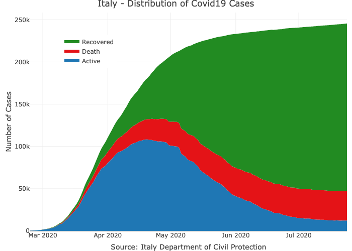

<!-- README.md is generated from README.Rmd. Please edit that file -->

# covid19italy

<!-- badges: start -->

<!-- badges: start --->

[](https://github.com/RamiKrispin/covid19italy/actions?query=workflow%3Abuild)
[](https://cran.r-project.org/package=covid19italy)
[](https://www.tidyverse.org/lifecycle/#experimental)
[](https://opensource.org/licenses/MIT)
<!-- badges: end -->

The covid19italy R package provides a tidy format dataset of the 2019
Novel Coronavirus COVID-19 (2019-nCoV) pandemic outbreak in Italy. The
package includes the following three datasets:

  - `italy_total` - daily summary of the outbreak on the national level
  - `italy_region` - daily summary of the outbreak on the region level
  - `italy_province` - daily summary of the outbreak on the province
    level

## Installation

You can install the released version of covid19italy from
[CRAN](https://CRAN.R-project.org) with:

``` r
install.packages("covid19italy")
```

And the development version from [GitHub](https://github.com/) with:

``` r
# install.packages("devtools")
devtools::install_github("RamiKrispin/covid19Italy")
```

## Usage

``` r
library(covid19italy)

data(italy_total)

head(italy_total)
#>         date hospitalized_with_symptoms intensive_care total_hospitalized home_confinement total_currently_positive new_currently_positive recovered death total_positive_cases total_tests
#> 1 2020-02-24                        101             26                127               94                      221                    221         1     7                  229        4324
#> 2 2020-02-25                        114             35                150              162                      311                     90         1    10                  322        8623
#> 3 2020-02-26                        128             36                164              221                      385                     74         3    12                  400        9587
#> 4 2020-02-27                        248             56                304              284                      588                    203        45    17                  650       12014
#> 5 2020-02-28                        345             64                409              412                      821                    233        46    21                  888       15695
#> 6 2020-02-29                        401            105                506              543                     1049                    228        50    29                 1128       18661
```

### Plotting the active cases distribution

``` r
library(plotly)

plot_ly(data = italy_total,
        x = ~ date,
        y = ~home_confinement, 
        name = 'Home Confinement', 
        fillcolor = '#FDBBBC',
        type = 'scatter',
        mode = 'none', 
        stackgroup = 'one') %>%
  add_trace( y = ~ hospitalized_with_symptoms, 
             name = "Hospitalized with Symptoms",
             fillcolor = '#E41317') %>%
  add_trace(y = ~intensive_care, 
                name = 'Intensive Care', 
                fillcolor = '#9E0003') %>%
  layout(title = "Italy - Distribution of Active Covid19 Cases",
         legend = list(x = 0.1, y = 0.9),
         yaxis = list(title = "Number of Cases"),
         xaxis = list(title = "Source: Italy Department of Civil Protection"))
  

```


### Plotting the daily cases distribution

``` r
plot_ly(data = italy_total,
        x = ~ date,
        y = ~total_currently_positive, 
        name = 'Active', 
        fillcolor = '#1f77b4',
        type = 'scatter',
        mode = 'none', 
        stackgroup = 'one') %>%
  add_trace( y = ~ death, 
             name = "Death",
             fillcolor = '#E41317') %>%
  add_trace(y = ~recovered, 
            name = 'Recovered', 
            fillcolor = 'forestgreen') %>%
  layout(title = "Italy - Distribution of Covid19 Cases",
         legend = list(x = 0.1, y = 0.9),
         yaxis = list(title = "Number of Cases"),
         xaxis = list(title = "Source: Italy Department of Civil Protection"))

```


